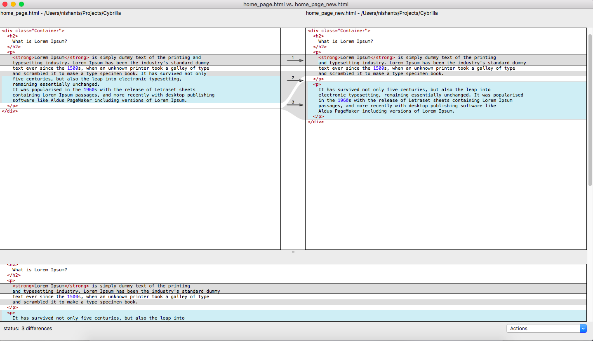

# Use Opendiff as default git difftool

Recently while working on tight scheduled project, I came across the scenario where I was having literally two huge files with having very subtle differences in the content. Consider it like your log files. Now, both of them were present locally and unfortunately not being tracked by any kind of version control system (Git, SVN, etc).

That's completely freaked me out.

Now, you can imagine my situation here as I need to find the differences between these two files and work accordingly. 

I googled a lot about how people have handled such situations.

Finally, after many attempts, I came with efficient solution using the `OpenDiff` tool.

Following is my short explaination on what this tool does and how you can leverage its features efficiently.

> Firstly, What is Opendiff?

Well, Mac(OS X) is coming with the utility tool called **opendiff**. However, it assumes that you should have Xcode installed as it provides **FileMerge** feature. The `FileMerge` is responsible for comparing, differentiating and merging any text document.

## opendiff
Uses **FileMerge** internally to graphically compare or merge files or directories as: 

```
opendiff file1 file2         # compare two files
```
or
```
opendiff dir1 dir2           # compare two directories
```

It launches a GUI of Diff that looks something like this:  



To get more help, you can check the `OpenDiff` manual using ```man opendiff``` command on the terminal.

## difftool
As we all know the importance of [Git](https://git-scm.com/). However, you can enhance it more by making `opendiff` tool as default _git difftool_.

You can do it simply by running following command:
```
git difftool --tool=opendiff
```
or
```
git config --global diff.tool opendiff
```

You can get the associated help using following command:
```
git difftool --tool-help
```

## mergetool
The adventure still has not ended yet. Alongwith above customization, you can set it as your default merge tool as well. Get help for this mergetool using:
```
git mergetool --tool-help
```

You may be interested to explore more on [mergetool here](http://knightlab.northwestern.edu/2014/12/19/how-the-git-mergetool-solved-my-anxiety-fears-and-most-importantly-my-merge-conflicts/).
